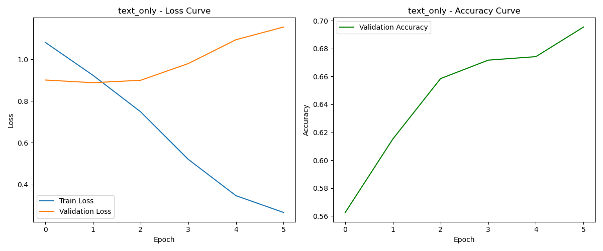
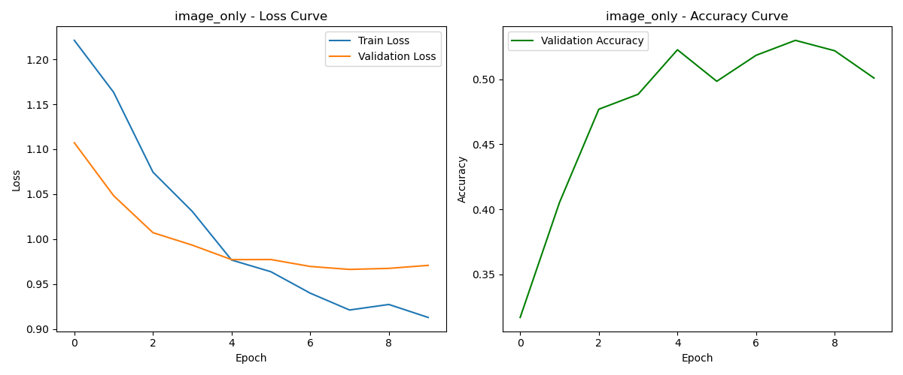
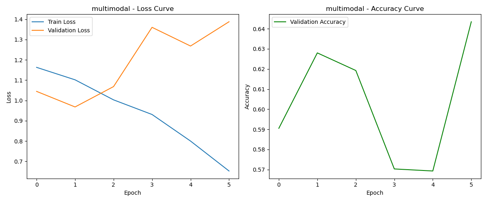

# 实验五 多模态情感分析
## 10212140414 盛子骜

**项目github仓库地址**:https://github.com/7774596/2024-autumn-AI.git

---
## 1.模型简介
我的模型设计可以分成三个部分：
- 通过BERT提取文本特征；
- 使用ResNet50（去掉全连接层）提取图像特征；
- 融合文本和图像特征（或单一种类特征）进行学习和训练。

具体而言，BERT初始提取的文本特征维度是768，通过一个线性层降到128；ResNet50提取2048维图像特征，然后也通过一个MLP降至128维。

接下来如果选择特征融合模式，会通过多头注意力机制融合文本和图像特征，并使用残差连接增强表达能力，最后FC对融合特征进行分类。

[完整的模型结构](images/model_structure.png)见`model_structure.png`


## 2.亮点与思考
### 1）模型选择
**为什么分别选择BERT和ResNet50作为特征提取模型**

选择这两个预训练模型是综合了任务需求和硬件资源：

BERT：这里可以和实验四作出区分，因为实验四是生成任务，BERT这种encoder-only的模型不适用，然而在本实验中作为文本特征提取就非常合适了，性能强大且稳定；

ResNet50：ResNet本身作为经典的CV任务好手，在前面的实验中已经很熟悉了，而50层的ResNet完全足够学习到深层次的图像特征，同时其已经在大规模图像数据集ImageNet上预训练，具备通用图像特征提取能力。

### 2）亮点技术

**多头注意力机制+残差连接的融合**
调整图像和文本特征的输入维度，相匹配之后并行计算多个注意力头以捕捉不同的特征交互模式，然后调用残差连接增强表达能力，最后再进行归一化的输出。
```python
    self.multihead_attention = nn.MultiheadAttention( #引入注意力机制
        embed_dim=128,  
        num_heads=8,    
        dropout=0.1     
    )
```

**图像数据增强**
这次我使用了`albumentations`库对图片数据进行了包括随机裁剪、模糊效果、网格畸变等的变换，增强模型鲁棒性和泛化能力。
```python
train_transform = A.Compose([
    A.RandomResizedCrop(size=(224, 224), scale=(0.8, 1.0)),
    A.HorizontalFlip(p=0.5),
    A.RandomRotate90(p=0.5),
    A.OneOf([
        A.GaussNoise(var_limit=(10.0, 50.0), p=0.5),
        A.GaussNoise(),
    ], p=0.2),
    …………
```

**训练优化**
在训练过程中综合使用了早停机制、学习率预热、余弦退火调度器和梯度裁剪等方法，保证训练过程稳定、高效。优化器采用了`AdamW`，它的优势在Lab4中也已经阐明，就不再赘述了。
```python
    scheduler_cosine = get_cosine_schedule_with_warmup(
        optimizer,
        num_warmup_steps=warmup_steps,
        num_training_steps=total_steps
    )
```

**训练方法**
使用`StratifiedKFold`进行交叉验证，并计算了类别权重，对不同类别样本给予合理的关注度。
```python
    class_weights = compute_class_weight( #计算类别权重
        'balanced',
        classes=np.unique(labels_encoded),
        y=labels_encoded
    )
```

## 3.结果分析
### 1）text-only



平均验证集准确率70.12%，在训练到4-5轮的时候val_loss开始上升，验证准确率也趋于稳定，此时触发了早停机制。

### 2）image-only



训练损失和验证损失可以做到一直缓慢下降，但是验证准确率提升很有限。

### 3）multimodel



训练损失稳定下降，但是验证损失和验证集准确率有持续波动，综合来看**效果不如text-only但是大幅好于image-only。**

**→分析**：
综合三种模式的训练效果可以发现，文本特征在这个情感分析任务中具有较高的信息量，BERT能够有效捕捉文本中的情感信息；然而图像提供的信息十分有限，甚至单独使用的效果比随机猜测（33.33%）也高不了多少。所以多模态融合只能在一定程度上提升了模型性能，出现了1+1<2的情况。当然，这肯定也跟我的模型选取和训练策略有关，比如以下是几个可能的优化方向：
- 可能使用更强大的图像特征提取模型、保留更高特征维度能改善特征质量；
- 可以把早停的忍耐度继续提高，多训练几个轮次观察更完整的表现；
- 优化图像和文本的特征融合策略等等。

实际上，文本数据由于表达的直接性（直接通过词汇表达感情如happy）、明确性（区别于图片依靠视觉元素的组合来生成某种含义），以及文本数据的结构化（可以通过分词等方法提取语义信息），相比之下图片信息包含的主要是非结构化的浅层信息，导致本身文字在情感表达上就具有先天的优势。

由于时间和设备硬件能力的关系，我在PC上的优化空间已经不多了（甚至batchsize设置为16就会爆显存），如果还有更充裕的时间其实可以上云尝试更多的选择。

## 4.实验过程心得/debug
1. 维度
   因为这次实验需要特征融合，不免会带来很多维度匹配的问题，实际上我碰到的大多数bug也是这方面的，解决办法就是根据Traceback找到输出层并对其维度，在model中也需要设计FC层对原始输入的维度进行降维（可能就是这步降得太低导致图像特征提取效果不明显，我也尝试过降到256维，效果并没有比128维好多少，最后还是考虑到运行时间降得更低了），所以还是挺遗憾的吧。
2. np.mean()的bug
   我在训练完进行画图的时候用到了np.mean()，它要求输入的数组长度一致，但是由于早停机制，每种情况其实epoch都是不一样长的，后续我需要手动对齐到最短长度。

其余的就是很多库依赖不对、网络不通等的bug，也就没有记录。


